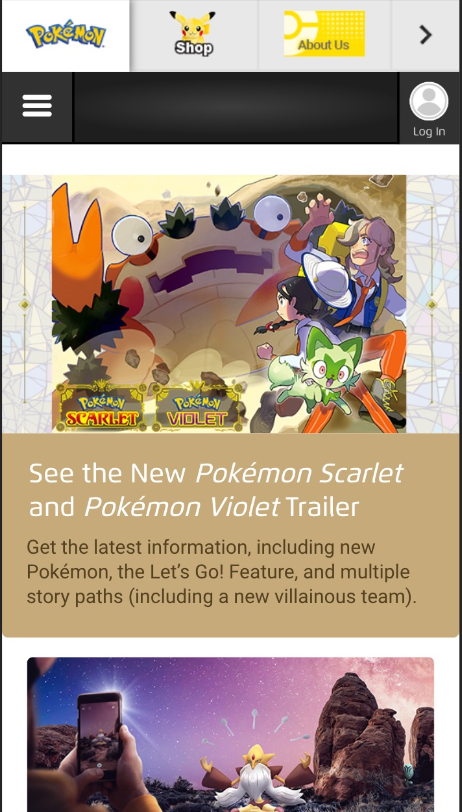
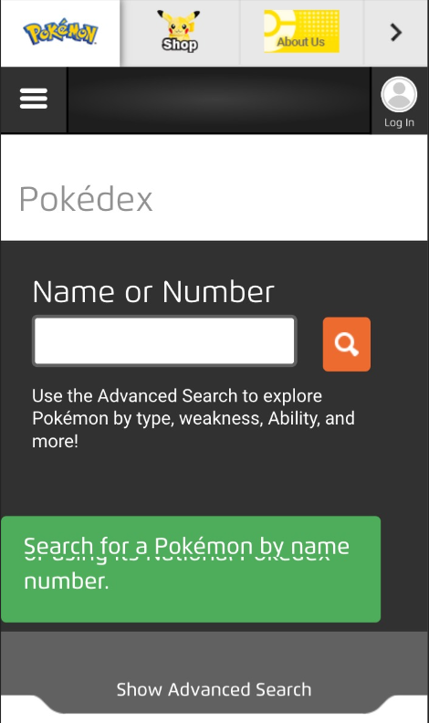
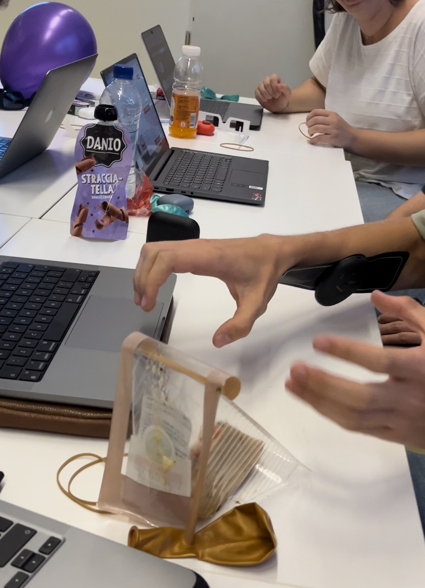
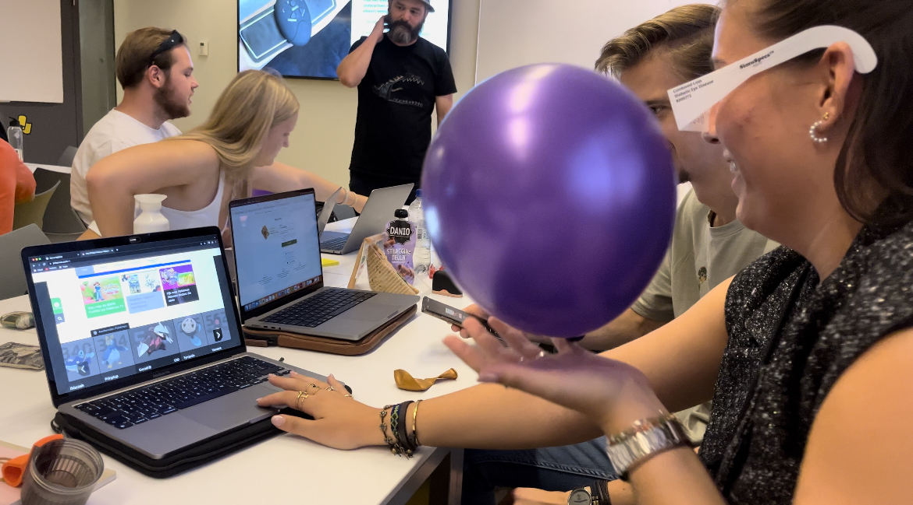

# **Procesverslag**

Markdown is een simpele manier om HTML te schrijven.
Markdown cheat cheet: [Hulp bij het schrijven van Markdown.](https://github.com/adam-p/markdown-here/wiki/Markdown-Cheatsheet#links)

Nb. De standaardstructuur en de spartaanse opmaak van de README.md zijn helemaal prima. Het gaat om de inhoud van je procesverslag. Besteedt de tijd voor pracht en praal aan je website.

Nb. Door open toe te voegen aan een details element kun je deze standaard open zetten. Fijn om dat steeds voor de relevante stuk(ken) te doen.

## **Jij**

uitwerken voor kick-off werkgroep
Auteur:
Donna van Roekel

Je startniveau:
Blauwe piste

Je focus:
Surface plane (Bling Bling)

## **Je website**

link naar de website die je gaat namaken óf de naam/omschrijving van je eigen ontwerp https://www.pokemon.com/us/ Deze site ga ik namaken. Ik ga er verder een eigen draai aan geven door er verschillende elementen aan toe te voegen.

**screenshot van de eerste pagina (small screen):** 

de eerste pagina: 

**screenshot van de tweede pagina (small screen):**

de tweede pagina: 

## **Toegankelijkheidstest 1/2 (week 1)**

de uitwerkingen na de test in de eerste week

### **Bevindingen:**
* de kleuren van de knoppen moeten fel zijn
* de knoppen kunnen iets groter
* genoeg contrast in kleuren
* alt tekst goed invullen ivm de voice over

### **voiceover**

Met de voiceover op de site las hij steeds alle namen van de images op die geen alt tekst hadden dus verspilde je veel tijd aan nutteloze informatie.

Dit probleem kan opgelost worden door de alt teksten te verbeteren en duidelijkere omschrijvingen te geven van de afbeelding waar je op staat.

### **motoriek**

het aanklikken van het menu ging heel moeilijk omdat de knop te klein was.

### **concentratie problemen (ballon)**

* de kleurrijke knoppen houden je aandacht er goed bij
* knoppen wel een beetje klein om echt je aandacht te trekken

### **elastiekjes**
* scrollen wordt heel lastig

### **visueel**
* meeste knoppen waren net groot genoeg om goed te kunnen vinden
* er is een goed kleurencontrast

## **uitwerkingen na 2e werkgroep**
 ### **de hele pagina**
 ik ben vergeten proces fotos te maken, in de eerste week heb ik eerst een breakdownschets gemaakt om de basis elementen te vinden voor mijn versie en heb de basis HTML gemaakt van de eerste pagina.

 ### **Dynamisch deel**
ik heb ook een beginnetje gemaakt aan het stylen van de header en footer van de pagina.

## **voortgang gesprek 1**

### **stand van zaken**
ik heb de basis HTML en basis-styling van de eerste pagina zo goed als af. ik kan volgende week verder met de details in de styling.

### **na de feedback**
ik was ivm een ongeluk op mijn weg naar amsterdam niet bij dit feedback moment (feedback heb ik later gehad in de volgende les)

## **voortgang gesprek 2**

### **stand van zaken**
ik heb een start gemaakt aan mijn tweede pagina in de HTML en had wat vragen over de CSS die niet helemaal lekker liep ode deze pagina. de eerste pagina was op dit moment open voor feedback, want ik was er nog niet helemaal blij mee.

### **na de feedback**
ik heb al mijn vragen kunnen stellen en mijn eigen domme foutjes met hulp van de docent snel kunnen oplossen 
* ik loop wat achter ivm ziek zijn geweest
* ik moet nog JS toevoegen aan mijn site
* ik kan een class toevoegen op de tweede pagina om de CSS makkelijker te maken

## **toegankelijkheidstest 2/2 (week 4)**

### **bevindingen**
* kleuren contrast is goed
* alt text op plaatjes werken nu wel goed

### **voiceover**
* de voiceover las netjes door mijn site heen
* de plaatjes las hij ook goed voor, de alt tekst is nu een omschrijving van het plaatje ipv de grootte van het plaatje
* hij las wel de hidden menu voor

### **visueel**
* kleurencontrast is goed
* knoppen grootte is beter nu

## **voortgang gesprek 3**
### **stand van zaken**
de site is bijna af op een paar kleine dingetjes na, ik heb hard gewerkt de afgelopen dagen. mijn github kan mijn documenten niet overnemen, laat elke keer lege mappen zien.

### **na de feedback**
* student assistenten hebben mij gehopen met mijn github probleempje
* paar laatste CSS aanpassingen doen

## **eindgesprek (week 5)**
### **dit ging goed/heb ik geleerd:**
* ik heb geleerd om het mezelf makkelijker te maken door Var te gebruiken
* ik kan basis html iets makkelijker schrijven door een breakdown schets te maken
* ik heb geleerd hoe ik een site meer accessible kan maken

### **dit was lastig/is niet gelukt:**
* JavaScript blijft een van mijn struggles tijdens coderen
* een goede planning maken en volgen vond ik ook een beetje lastig ivm werk en andere lessen.

## **eindgesprek**

### Feedback
* ik moet wat meer aandacht besteden aan de vormgeving van de site
* ik moet wat uitgebreider reflecteren in mijn readme
* mijn tweede page iets uitbreiden

## na de feedback
na deze feedback ben ik gaan kijken naar mijn site en begon ik met aanpassingen maken aan de buttons, tekst en tweede page. ook heb ik gewerkt aan de vormgeving van mijn hamburger menu. ik heb aanpassingen gemaakt aan de darkmode feature, waardoor nu niet alleen de achtergrond veranderd maar ook de tekst kleur. ik heb alle buttons een hover mode gegeven waardoor ze er minder saai en plat uitzien. 
